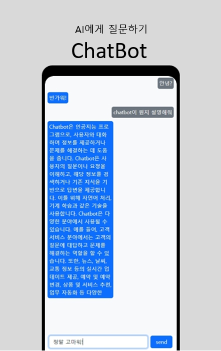

<h2 align="center">
  📔 Chatbot
  <h6>
  애플코딩님(유튜브)의 코드를 바탕으로 만들어짐
  </h6> 
</h2>

  

 

 &nbsp;
 &nbsp;
 &nbsp;
 
 &nbsp;

### How to use...
---------------
1. Send any messages to chatbot.
2. It will answer you question.
3. You can also write in Korean.